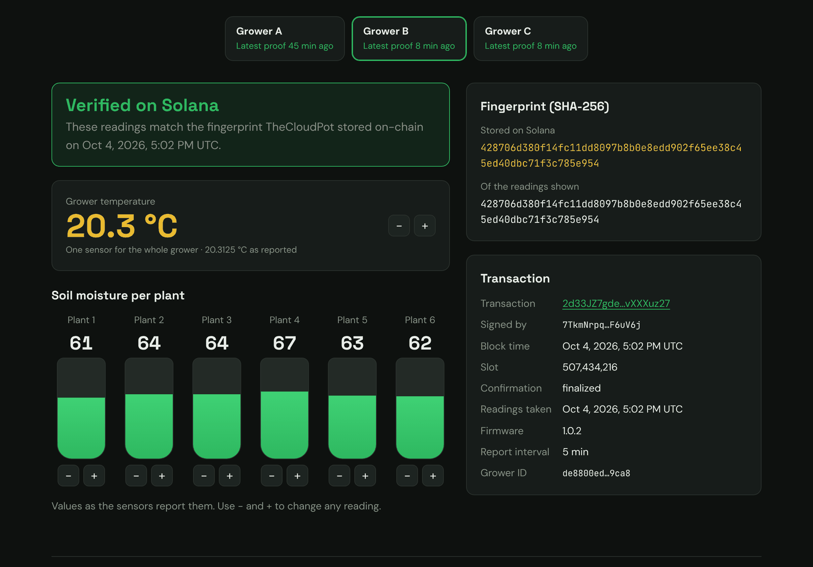

# TheCloudPot — Proof of Grow

**Tamper-evident grow data on Solana.** Every 15 minutes, soil-moisture and temperature readings from real
TheCloudPot growers are fingerprinted (SHA-256) and anchored on the Solana blockchain. Anyone can later check
that a reading has not been changed.

- **Live verifier:** https://proof.thecloudpot.com
- **Network:** Solana **Devnet** (test network, free test SOL; no real funds are used)
- **Status:** running in production on Firebase, anchoring 3 growers every 15 minutes

> Try it: open the live page, pick a proof, change one soil-moisture value by 1 point, and watch
> "Verified on Solana" turn into "Doesn't match the blockchain".

[](https://proof.thecloudpot.com)

<sub>Live page, Oct 4 2026: an automatic proof from Grower B, verified in the browser against its finalized Solana Devnet transaction.</sub>

---

## How it works

```
Realtime Database ──► sanitize ──► canonical JSON (RFC 8785) ──► SHA-256 ──► Solana Memo tx ──► verify
   (grower data)      (allow-list,   (same snapshot, same bytes)                (only the hash      (in the browser,
                       HMAC device ID)                                           goes on-chain)      against the chain)
```

1. **Read.** A scheduled Cloud Function reads each grower under `/thecloudpot/arduinos` (read-only).
2. **Sanitize.** Only an allow-list of fields enters the snapshot (`pog.snapshot.v1`): six soil-moisture readings,
   temperature, firmware version, report timestamp and interval. A missing or non-numeric reading is rejected,
   never replaced with zero. The hardware ID (MAC) is replaced by an HMAC-SHA-256 pseudonym.
3. **Canonicalize + hash.** RFC 8785 (JCS) canonical JSON, then SHA-256.
4. **Anchor.** The hash goes into a Solana **Memo** transaction signed by the backend wallet. The attempt is saved
   *before* sending; a proof is marked `anchored` only after `finalized` confirmation. Re-running reuses existing
   proofs (idempotent), and timeouts are reconciled by signature before any resend.
5. **Verify.** The verifier never trusts our receipt: it recomputes the hash, fetches the transaction from Solana,
   checks it succeeded, that the expected wallet signed it and that the Memo is ours, and compares hashes.
   Result: `verified`, `hash_mismatch`, `invalid_snapshot`, `invalid_proof` or `pending_or_unavailable`.

### What the proof shows, and what it does not

| Shows | Does not show (yet) |
|---|---|
| The snapshot is byte-for-byte the one anchored | That sensors are calibrated or readings physically true |
| It existed no later than the block time | That a specific device produced it (the backend wallet signs, not the controller) |
| Which wallet signed it | Anything about fields outside the allow-list (schedules, ON/OFF states) |

### Privacy

On-chain: only the hash and five fixed labels. Never published: raw readings on-chain, MAC addresses, the HMAC
secret, the wallet private key. Secrets live in Google Secret Manager.

---

## Repository layout

```
src/                 core library (TypeScript, Node 24)
  sanitize.ts          allow-list, schema pog.snapshot.v1, HMAC pseudonym
  strict-json.ts       JSON parser that rejects duplicate keys
  canonicalize.ts      RFC 8785 (JCS) + UTF-8
  hash.ts / payload.ts SHA-256, Memo payload, proof ID
  solana.ts            Memo Program v2: build, sign, send, read back
  create-proof.ts      idempotent anchoring with lock, reconciliation and receipts
  verify.ts            independent verification (5 result states)
  anchor-job.ts        one anchoring cycle over all growers
  firestore-store.ts   proof records in Firestore with a lease lock
  cli/                 local commands (snapshot, publish, verify, tamper test…)
functions/src/       Cloud Functions: pogAnchor (every 15 min), pogProofs (read-only API)
site/                public verifier page (static; verifies in the browser)
tests/               28 offline tests on a simulated chain
docs/                Portuguese README (full operator guide)
```

## Run it locally

Requires Node 22+ (the Cloud Functions runtime is Node 24).

```bash
npm install
npm test                       # 28 offline tests, no network, no secrets
```

The offline tests cover determinism of the hash, property-order independence, RFC 8785 vectors, rejection of
incomplete input and duplicate keys, the 1-point tamper case, wrong signer, RPC outage (reported as unavailable,
never as tampering), on-chain failure, resend after timeout, and the anchoring job.

Anchoring locally against Devnet (needs a funded Devnet wallet and an export file):

```bash
npm run keygen                 # creates a Devnet wallet + .env (never committed)
npm run snapshot -- --input fixtures/example-export.json --device AA:BB:CC:DD:EE:01
npm run publish-proof -- --input fixtures/example-export.json --device AA:BB:CC:DD:EE:01
npm run tamper-test -- --input fixtures/example-export.json --device AA:BB:CC:DD:EE:01
```

Deployment, secrets and operations are documented in [docs/README.pt-BR.md](docs/README.pt-BR.md) (Portuguese).

## Tech

TypeScript · Node.js 24 · Solana web3.js (Memo Program v2) · RFC 8785 canonical JSON · SHA-256 / HMAC-SHA-256 ·
Firebase Cloud Functions (2nd gen), Firestore, Realtime Database, Hosting, Secret Manager · Vitest

## Roadmap

1. Batch many snapshots into a Merkle root (one transaction per batch).
2. A Solana program with per-grow accounts ("Grow Passport").
3. Device-side signing, so the proof covers the controller itself.
4. New evidence types: genetics, harvest and lab results.

## License

Proof of Grow is free software: you can redistribute it and/or modify it under the terms of the
**GNU General Public License v3.0 or later** (see [LICENSE](LICENSE)).

Copyright (C) 2026 Andrey (andrey-zenith)

**Scope.** This license covers only the code in this repository. It does **not** cover any other TheCloudPot
software (the Smart Grower firmware, the mobile app, the thecloudpot.com website or other backend services),
which remain proprietary.

**Trademarks.** The TheCloudPot name and logos (`site/logo.png`, `site/logo-mark.png`, `site/favicon.png`) are
trademarks of TheCloudPot and are not licensed under the GPL. If you redistribute or deploy a modified version,
remove them and use your own branding.
